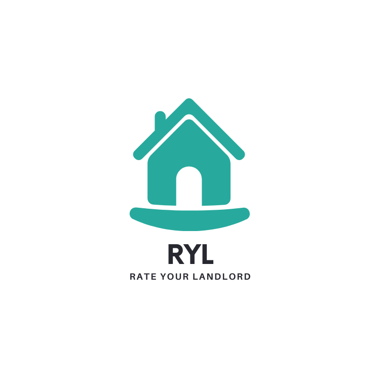

# RYL 

## What is it?
RYL is a social app to empower renters by allowing them to review landlords and share their first hand experiences with living at one of the residences as a tenant.

### Technologies Incorporated
The app is styled using StyledComponents, Reactstrap, and CSS although you'd never know it given its current condition.

The app implements TypeScript using React under the Node.js framework.

### User Interaction by CRUD
RYL utilizes 3 tables from the server and lets the user Create, Read, Update, and Delete on two of the three. The user table only has create and read functionality at the moment. 

Admins have the ability to Update and Delete on two of the tables as well. 

### Data Storage and Transfer
The data is encrypted and pulls from a server deployed with Heroku. You can view the production application here => [RYL App](https://ryl-client.herokuapp.com/) or the source code for the back-end here => [RYL Server](https://github.com/joshuapcasey/ryl-server)

